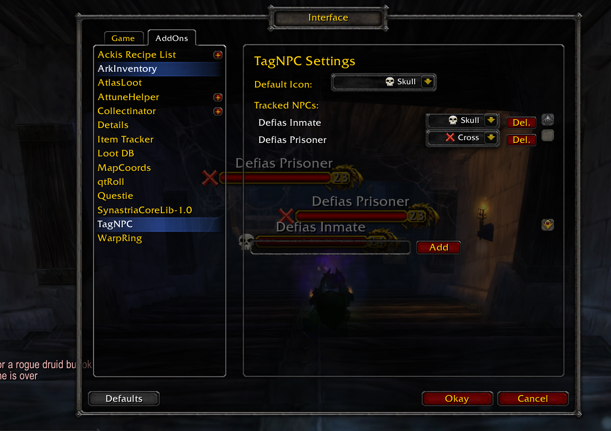
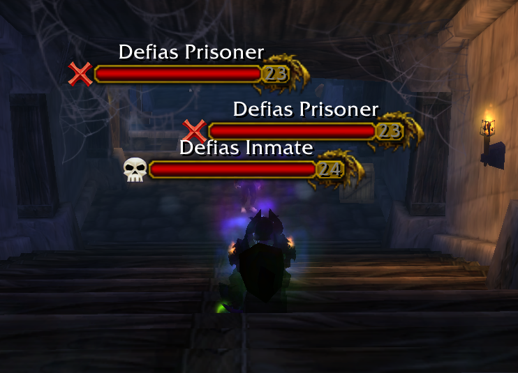

# TagNPC

**TagNPC** is a lightweight World of Warcraft addon that allows you to **track specific NPCs** by overlaying **raid target icons** on their nameplates.

---

## 🔧 Features

- Automatically overlays raid target icons on selected NPC nameplates.
- UI settings panel with:
  - **default icon** selection.
  - Scrollable list of tracked NPCs.
  - Per-NPC icon customization.
  - Add/remove NPCs directly from the panel.
- Slash commands to quickly add/remove NPCs without opening the settings.

---

## 📦 Installation

1. Download or clone this repository.
2. Move the `TagNPC` folder into your WoW AddOns directory:

   ```
   World of Warcraft/Interface/AddOns/
   ```

3. Restart the game or run `/reload`.

---

## 🖥️ UI Access

- Open the in-game settings via:
  ```
  /tagnpc
  ```
- To:
  - Select the default icon used for new NPCs.
  - Add a new NPCs by name.
  - Remove NPCs with the "Del." button.
  - Choose a custom icon for each NPC.

---

## 💬 Slash Commands

You can also manage NPCs directly through the chat:

| Command | Description |
|---------|-------------|
| `/tagnpc` | Opens the settings UI. |
| `/tagnpc add [name]` | Adds an NPC to track (e.g. `/tagnpc add Angry Villager`). |
| `/tagnpc del [name]` | Removes an NPC from tracking (e.g. `/tagnpc del Angry Villager`). |

> ✅ NPC names **with spaces** are supported.

---

## 📸 Screenshots

| Settings Panel | Nameplate Icons |
|----------------|----------------|
|  |  |

---

## 📝 Notes

- Nameplates must be **enabled in the game's interface settings** for the icons to appear.
- The addon uses Blizzard's raid icon textures (`Star`, `Skull`, etc.).
- Icons are only shown on nameplates without a named frame (usually enemy NPCs).

---

## 📜 License

MIT License

---
